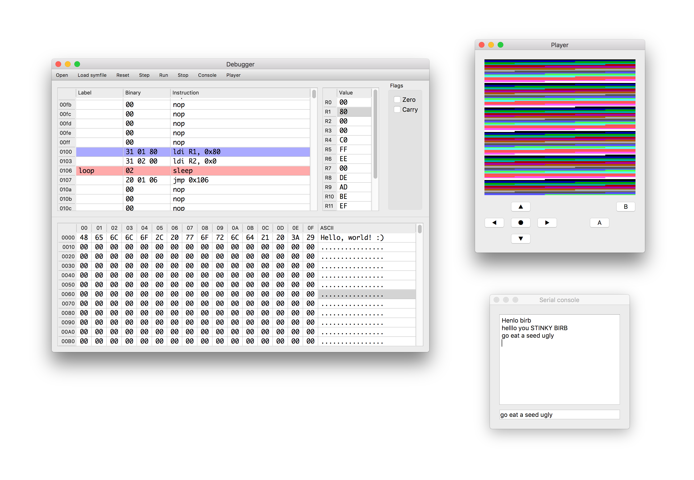

# Debugger



## Cloning

The repository has submodules, so either get them when cloning it

```console
    $ git clone --recurse-submodules https://github.com/jiri/thesis-debugger
```
    
Or fetch them after cloning

```console
    $ git clone https://github.com/jiri/thesis-debugger
    $ cd thesis-debugger
    $ git submodule update --init --recursive
```
    
## Building

Make sure you have the following dependencies installed:

 - [Fmt](http://fmtlib.net/latest/index.html) 4.0.0
 - [Qt](https://www.qt.io/) 5.10

You might need to point CMake to your installation of Qt5 directly, using the flag `-DCMAKE_PREFIX_PATH=<path>`.

Then you can build the project using CMake

```console
    $ mkdir -p build && cd build
    $ cmake ..
    $ make
```

## Usage

Load the binary file using the `Open` button or the canonical shortcut for your platform (usually `⌘ + o` or
`ctrl + o`). This will reset the Mcu and pause execution. After that, you can:

 - Place a breakpoint using double-click or right-click in the instruction view
 - Run the program until the next breakpoint using the `Run` button or `F5`
 - Stop the execution using the `Stop` button or `F6`
 - Step over a single instruction using the `Step` button or `F8`
 - Reset the Mcu using the `Reset` button or `F1`
 
Memory and register content can be edited by double-clicking the appropriate field in their respective views.
